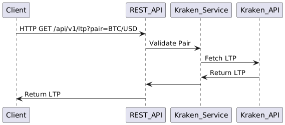

# LTP Service

This is a Go service that provides an API for retrieving the Last Traded Price (LTP) of crypto currencies


## Features
- REST API: Fetch LTP for one or more currency pairs.
- Docker Support: Easy to run with Docker Compose.

## Requirements

- Go 1.23 or higher
- Docker, Docker Compose (optional)
- Go-swagger

## Building and Running the Application

Start the service:

```bash
docker-compose up --build
```

Test the API:

```bash
curl "http://localhost:8080/api/v1/ltp?pair=BTC/USD"
```


## API
GET `/api/v1/ltp`
Fetch LTP for currency pairs.

Query Params:

- pair: List of pairs (e.g., BTC/USD, BTC/EUR).

Example:

```bash
curl "http://localhost:8080/api/v1/ltp?pair=BTC/USD&pair=BTC/EUR"
```
Response:

```json

{
  "ltp": [
    {"pair": "BTC/USD", "amount": 50000.0},
    {"pair": "BTC/EUR", "amount": 45000.0}
  ]
}
```


## UML Diagram


For questions, contact to [telegram](t.me/buntov)